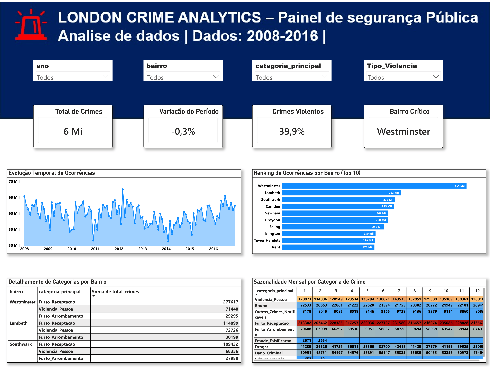

# Projeto: Pipeline e Análise de Criminalidade em Londres (London Crime Analytics)

## 📌 Visão Geral do Projeto

- **Problema abordado**: A análise de grandes volumes de dados de segurança pública em metrópoles como Londres exige pipelines eficientes que consolidem milhões de registros brutos sem perda de valor analítico. Dados brutos sem filtragem geram altos custos de processamento na nuvem e lentidão em ferramentas de Business Intelligence.

- **Objetivo**: Extrair, otimizar, tratar e visualizar a série histórica de crimes em Londres (2008 a 2016), aplicando engenharia de dados em nuvem para reduzir o volume do dataset e entregar um dashboard interativo no Power BI com insights acionáveis sobre sazonalidade, geografia e categorias criminais.

- **Metodologia**: Construção de um pipeline de dados automatizado utilizando **Google BigQuery (SQL)** para filtragem e agregação direta na nuvem, **Python (VS Code)** para ingestão e limpeza, e **Power BI** para modelagem relacional e dashboards executivos.

## 🎯 Etapas do Projeto

### 1. Otimização e Arquitetura de Dados na Nuvem (BigQuery)
- **Desafio de Volume**: O dataset público original no BigQuery (`bigquery-public-data.london_crime.crime_by_lsoa`) continha **mais de 13 milhões de registros brutos**, incluindo milhões de linhas com valor `0` (crimes não ocorridos no período/área).
- **Estratégia SQL na Nuvem**: Execução de uma query otimizada com filtro `WHERE value > 0` e agregação por ano, mês, bairro, categoria e subcategoria (`GROUP BY`), reduzindo a base final extraída para apenas **91.559 linhas (redução de mais de 99% no volume de dados)**, mantendo 100% dos eventos reais registrados.

### 2. Fontes de Dados
| Fonte | Tipo | Método de Coleta | Link |
|-------|------|------------------|------|
| London Crime Data (Google BigQuery Public Data) | Estruturado (BigQuery Cloud Data Warehouse) | API / Script Python (`google-cloud-bigquery`) | [Google Cloud BigQuery Public Datasets](https://console.cloud.google.com/bigquery?ws=!1m4!1m3!3m2!1sbigquery-public-data!2slondon_crime) |

- **Registros Extraídos (RAW)**: 91.559 linhas (consolidadas a partir de +13 milhões brutos)
- **Escopo Temporal**: 2008 a 2016 (Série Histórica Completa)
- **Granularidade Geográfica**: 33 Bairros/Distritos (*Boroughs*) e 4.835 Regiões Microgeográficas (*LSOA Codes*)
- **Licença**: UK Open Government Licence (OGL)

### 3. Análise Exploratória e Pipeline ETL (EDA)
- **Scripts Python**:
  - [script_importacao_crime_london.py](script/script_importacao_crime_london.py) - Conexão via API ao Google BigQuery, extração dos dados agregados na nuvem e exportação do arquivo para a pasta `data/raw/` (`crimes_londres_raw.csv`).
  - [script_limpeza_padronizacao_crime_london.py](script/script_limpeza_padronizacao_crime_london.py) - Padronização de nomes de colunas, remoção de colunas/linhas nulas e vazias, ajuste de tipagem de dados e salvamento na pasta `data/ready/` (`crimes_londres_limpo.csv`).

**Bibliotecas utilizadas**:
- `google-cloud-bigquery` (Conectividade e execução de queries no Data Warehouse na nuvem)
- `pandas` (Manipulação, verificação de duplicadas e exportação)
- `os`, `sys` (Gerenciamento de caminhos do sistema operacional e ambiente de execução)

- **Principais descobertas e métricas gerais (2008 - 2016)**:
  - 🚨 **Volume Total de Ocorrências**: **6 Milhões de crimes** registrados na grande Londres ao longo dos 9 anos analisados.
  - 📉 **Variação do Período**: Queda geral de **-0,3%** na criminalidade entre o início (2008) e o fim do período (2016).
  - ⚠️ **Proporção de Crimes Violentos**: **39,9%** do total das ocorrências registradas enquadram-se na categoria de crimes contra a pessoa / violência.
  - 🏙️ **Bairro Mais Crítico**: **Westminster** lidera com folga o ranking absoluto de criminalidade (455 mil ocorrências no acumulado histórico e 48.330 crimes registrados somente em 2016).
  - 🔝 **Top 5 Bairros mais perigosos em 2016**:
    1. **Westminster**: 48.330 crimes
    2. **Lambeth**: 34.071 crimes
    3. **Southwark**: 31.636 crimes
    4. **Newham**: 30.090 crimes
    5. **Tower Hamlets**: 29.253 crimes
  - 📍 **Cobertura Territorial**: A base cobre 33 distritos com uma média de **146,5 regiões LSOA por bairro**, variando de **Croydon** (maior cobertura, com 220 LSOAs) até a **City of London** (área financeira, com apenas 6 LSOAs).
  - 📅 **Sazonalidade Mensal**: Picos de ocorrências registrados consistentemente nos meses de verão europeu (julho/agosto) e no encerramento de ano (dezembro, onde Westminster atingiu pico de 4.751 crimes em 12/2016).

### 4. Estrutura do Pipeline (Raw → Ready)
- **Camada RAW (`data/raw/`)**: Armazena o extrato bruto gerado pelo BigQuery contendo 91.559 linhas consolidadas.
- **Camada READY (`data/ready/`)**: Arquivo perfeitamente tratado, padronizado, sem colunas/linhas nulas, pronto para ingestão pelo Power BI.

### 5. Dashboard no Power BI

<div align="center">
  
</div>

<br>

- **Painel Executivo de Indicadores (2008 - 2016)**:
  - **Cards Principais (KPIs)**: Total de Crimes (6 Mi), Variação do Período (-0,3%), Crimes Violentos (39,9%), Bairro Crítico (Westminster).
  - **Evolução Temporal de Ocorrências**: Gráfico de linha temporal mostrando a flutuação mensal dos crimes entre 2008 e 2016 (oscilando entre 50 mil e 68 mil crimes/mês).
  - **Ranking de Ocorrências por Bairro (Top 10)**: Westminster (455 Mil), Lambeth (292 Mil), Southwark (279 Mil), Camden (275 Mil), Newham (262 Mil), Croydon (260 Mil), Ealing (252 Mil), Islington (230 Mil), Tower Hamlets (229 Mil) e Brent (228 Mil).
  - **Detalhamento de Categorias por Bairro**: Tabela com decomposição dos tipos criminais por região (ex: Furto/Receptação com 277.617 registros em Westminster).
  - **Sazonalidade Mensal por Categoria**: Matriz de calor analisando quais meses do ano concentram os maiores volumes por tipo criminal (destaque para Furto/Receptação com média de mais de 220 mil casos por mês do ano).

## 🛠️ Tecnologias Utilizadas

| Ferramenta | Finalidade |
|------------|------------|
| Google BigQuery (SQL) | Data Warehouse, filtragem e agregação do Big Data público (+13M linhas) |
| Python (Pandas, BigQuery API) | Pipeline ETL automatizado, extração e limpeza de dados |
| VS Code | IDE para desenvolvimento e execução dos scripts Python |
| Power BI | Visualização de dados, modelagem DAX e dashboard interativo |
| Git / GitHub | Controle de versão e documentação do repositório |

## 📂 Estrutura do Repositório

```text
london-crime-data-pipeline-bigquery/
│
├── dash/
│   ├── dashboard_crimes_londres.pbix          # Arquivo do Power BI
│   └── preview_dashboard.png                  # Print/Screenshot do Dashboard
│
├── data/
│   ├── raw/
│   │   └── crimes_londres_raw.csv             # Dado extraído da nuvem (91.559 linhas)
│   └── ready/
│       └── crimes_londres_limpo.csv           # Dado tratado pronto para o Power BI
│
├── script/
│   ├── script_importacao_crime_london.py      # Extração do BigQuery via Python
│   └── script_limpeza_padronizacao_crime.py   # Script de limpeza e padronização ETL
│
├── .gitignore
└── README.md                                  # Documentação do projeto
